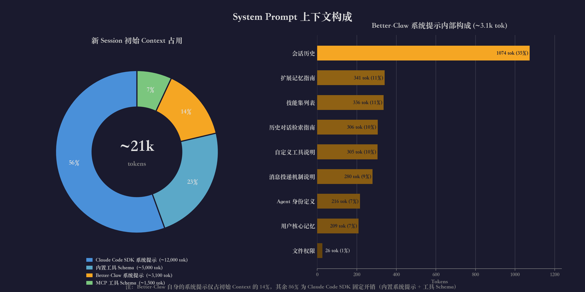

# Better-Claw

### Turn your Claude Code into a ClawdBot.

把你本地的 Claude Code 变成一个随时在线的私人 AI 助手 —— 通过 Telegram 对话、语音消息与它交互，它拥有和你桌面 Claude Code 完全相同的能力：MCP 工具、Skills、文件操作、Shell 命令，外加长期记忆和定时任务。

基于 [Claude Agent SDK](https://docs.anthropic.com/en/docs/agents-and-tools/claude-agent-sdk) 构建，支持 Telegram / CLI 多平台接入和多用户管理。

## 前置依赖

- **Node.js** ≥ 20
- **Claude Code CLI** 已安装并完成认证（`claude --version` 可正常输出）— Agent SDK 复用 CLI 认证，无需单独配置 API Key

## 快速开始

```bash
# 1. 克隆仓库并安装依赖。
git clone https://github.com/your-org/better-claw.git
cd better-claw
npm install

# 2. 初始化数据目录（首次运行会自动创建并复制 config.example.yaml）。
npx tsx src/index.ts
# 输出：Initialized new data directory: .../data
# 输出：Please edit .../data/config.yaml and restart.

# 3. 编辑配置文件，填入实际值（至少检查 anthropic 和 telegram 部分）。
$EDITOR data/config.yaml

# 4. 启动服务。
npx tsx src/index.ts
```

## 数据目录 (`--data-dir`)

每个数据目录对应一个独立的 agent 实例，包含配置、用户数据、日志和会话历史。通过 `--data-dir` 参数可以在同一台机器上运行多个 agent 实例：

```bash
# 使用默认 ./data/ 目录。
npx tsx src/index.ts

# 指定自定义数据目录。
npx tsx src/index.ts --data-dir /path/to/my-agent

# start.sh 自动重启模式也支持 --data-dir。
./start.sh --data-dir /path/to/my-agent
```

**首次使用新目录时**，程序会自动创建目录、复制 `config.example.yaml` 作为初始配置，然后退出并提示编辑配置文件。

## 配置文件

配置文件位于 `<data-dir>/config.yaml`，所有字段都有默认值。最小可运行配置为空文件（Agent SDK 使用 CLI 认证）。

完整配置项参考 [config.example.yaml](config.example.yaml)。

关键配置说明：

| 字段 | 说明 |
|------|------|
| `anthropic.authToken` / `baseUrl` | 通过代理服务器认证时使用 |
| `telegram.botToken` | 不配置则不启动 Telegram 适配器 |
| `logging.directory` | 相对路径基于 dataDir 解析，默认 `logs` |
| `session.rotationTimeoutHours` | 超过此小时数自动开新会话 |
| `session.carryoverTurns` | 轮转时携带旧 session 最后 N 轮对话到新 session（默认 5） |

## 权限与安全

多用户环境下，Better-Claw 通过多层机制隔离用户对文件系统和环境变量的访问。

### 权限组

每个用户属于一个权限组（默认 `user`），通过有序规则链控制文件系统访问。规则支持 `${userWorkspace}`、`${userDir}`、`${dataDir}`、`${home}`、`${configFile}` 等变量。详见 [config.example.yaml](config.example.yaml) 的 `permissions.groups` 部分。

### 受保护路径 (`protectedPaths`)

非 admin 用户自动追加 `deny readwrite` 规则到规则链末尾（不可被权限组或工作组覆盖）：

```yaml
permissions:
  protectedPaths:
    - "${configFile}"    # 配置文件本身（含 API Key 等敏感信息）
    - "${home}/.claude"  # Claude CLI 认证目录
```

默认保护 `config.yaml` 和 `~/.claude`。设为空数组可禁用（不推荐）。

### 环境变量过滤 (`envFilter` / `envExtra`)

非 admin 用户的 SDK subprocess 默认继承所有环境变量。通过 `envFilter` 可按通配符模式过滤敏感变量，通过 `envExtra` 可额外注入变量：

```yaml
permissions:
  envFilter:
    - "ANTHROPIC_*"  # 过滤所有 ANTHROPIC_ 开头的变量
    - "AWS_*"
    - "SECRET_*"
  envExtra:
    MY_VAR: "value"  # 额外注入
```

SDK 必需的 Anthropic 变量始终从 `anthropic` 配置注入，不受 `envFilter` 影响。

### System Prompt 安全策略

非 admin 用户的 agent 会在 system prompt 中被指示不得泄露环境变量、API Key 和配置文件内容，作为纵深防御。

## 记忆系统

Better-Claw 提供两层记忆系统：

- **Core Memory** — 用户偏好、身份等高频信息，自动注入每次对话的 system prompt
- **Extended Memory** — 知识、笔记、参考资料等长内容，agent 按需读取

每条 Extended Memory 支持 `summary` 字段（一句话摘要）。列出所有条目时会显示 key + summary，帮助 agent 快速判断需要读取哪个条目，无需逐个打开。

## 会话轮转与上下文衔接

会话在以下情况自动轮转：
- 超时（用户最后消息距今超过 `rotationTimeoutHours`）
- Context 过大（token 占比达到 `rotationContextRatio` / `rotationForceRatio`）
- 手动（用户发送 `/new` 命令）

**Carryover 机制**：不论何种原因触发轮转，系统都会从旧 session 最后 N 轮对话中提取 carryover，以规则化 digest 方式注入新 session 的 system prompt，确保模型不会遗忘轮转前的对话内容。

一轮 = 1 条用户消息 + 该轮最后 1 条 agent 回复。agent 在循环中可能产生多条中间 assistant 消息，carryover 只保留每轮的最终回复。

Digest 策略（节省 token）：
- 用户消息：超过 `carryoverUserMaxChars` 字符则截断，并注明总长度
- Agent 回复：超过 `carryoverAssistantHeadChars` + `carryoverAssistantTailChars` 则只保留开头和结尾原文，中间省略并注明总长度；未超过则保留全文

Carryover 在新 session 中始终保留，直到该 session 本身被轮转。

### System Prompt 上下文构成

每个新 session 开始时，初始 context 约占 ~21k tokens（200k 窗口的 ~11%）。下图展示了各部分的占比：



其中 86% 是 Claude Code SDK 的固定开销（内置系统提示 + 工具 Schema），Better-Claw 自身的系统提示仅占 14%，最大的一块是会话历史（Session History）。

相关配置项（均在 `session` 下）：

- `carryoverTurns` — 携带的轮次数，默认 5，设为 0 禁用
- `carryoverUserMaxChars` — 用户消息截断阈值，默认 500
- `carryoverAssistantHeadChars` — agent 回复保留开头字符数，默认 200
- `carryoverAssistantTailChars` — agent 回复保留结尾字符数，默认 200

## Skill 系统

Better-Claw 支持树形 skill / skillset 管理，通过配置路径列表发现和组织 agent 技能。

### 目录结构约定

- **SKILL.md** — 叶子节点（具体 skill），包含完整指引内容
- **SKILLSET.md** — 中间节点（分类索引），用于组织子 skill

```
skills/
├── coding/                  ← Skill Set
│   ├── SKILLSET.md
│   └── typescript/          ← Skill
│       └── SKILL.md
└── standalone-skill/        ← 顶层 Skill
    └── SKILL.md
```

### Frontmatter 格式

```yaml
---
name: my-skill
description: 这个 skill 做什么的简要说明
---
```

### 工作原理

1. 启动时扫描 `config.yaml` 中 `skills.paths` 配置的所有路径
2. 顶层节点的名称和描述注入到 system prompt
3. Agent 通过 `load_skillset` MCP 工具按需加载和导航 skill 树
4. SDK 通过 `settingSources: ['user']` 原生发现 `~/.claude/skills/` 下的 skill，自动出现在 `Skill` 工具和 system prompt 的 `<system-reminder>` 中

### 配置

```yaml
skills:
  paths:
    - "~/.claude/skills"    # Claude Code 默认路径（兼容原生/第三方 skill）
    - "./skills"            # 项目内置 skill
    - "~/my-custom-skills"  # 自定义路径
```

### 内置 Skills

仓库 `skills/` 目录自带以下技能：

- `playwright` — 浏览器自动化（导航、截图、表单填写），需配置 Playwright MCP server
- `peekaboo` — macOS 屏幕截图与 GUI 自动化，需配置 Peekaboo MCP server
- `speech-to-text` — 语音/音频转录为文字，需安装 `openai-whisper` 和 `ffmpeg`

参考各 skill 目录下的 `SKILL.md` 查看详细说明和依赖要求。

## Claude Code Settings 继承

Better-Claw 与 Claude Code SDK 的 settings 系统协作，通过两个层面加载配置：

**SDK 原生加载（`settingSources: ['user']`）：**

SDK 自动加载 `~/.claude/settings.json`（user 层），从中发现：
- `~/.claude/skills/` 下的原生 skill（出现在 SDK 的 `Skill` 工具和 system prompt 中）
- user 层的 `mcpServers`（自动启动）

不加载 `settings.local.json`（local 层），以避免其中的 `permissions.allow` 规则（如 WebFetch domain 限制）被 SDK 转化为沙箱网络限制。

**Better-Claw 显式加载（project + local 层）：**

Better-Claw 额外读取 project 和 local 层的 settings 文件，提取以下字段合并到 agent 配置中：
- `mcpServers` — 外部 MCP 服务器配置（stdio / sse / http）
- `disallowedTools` — 工具禁用列表

读取路径（仅 project + local）：
- `.claude/settings.json`（project，项目级配置）
- `.claude/settings.local.json`（local，本地覆盖，通常 gitignore）

**不继承的字段：**

- `permissions`（allow/deny 规则）— 与 Better-Claw 自有的权限系统冲突
- `model`、`effortLevel` 等 — 由 Better-Claw 的 `config.yaml` 统一管理

同名 MCP server 按层级覆盖（local > project > user），`disallowedTools` 跨层级去重合并。

配置热重载时（`/admin reload-config`）会同步刷新 Claude Code settings 缓存。

## 对话命令

在 Telegram 或 CLI 对话中可使用以下命令：

| 命令 | 说明 |
|------|------|
| `/bind <token>` | 绑定账号，将当前平台用户关联到系统用户 |
| `/stop` | 中断当前正在执行的 AI 响应，队列中的后续消息不受影响 |
| `/new` | 归档当前会话并开始一个全新会话 |
| `/restart` | 重启整个服务进程（由外层进程管理器重新拉起） |
| `/admin <subcommand>` | 管理员命令，支持用户管理和工作组管理（仅 admin 用户可用，详见 `/admin help`） |

### /admin 命令

仅 `permissionGroup === 'admin'` 的用户可使用。支持以下子命令：

- **用户管理**：`user create/list/info/rename/set-group/delete/bind`
- **工作组管理**：`workgroup create/delete/list/info/add-member/remove-member/set-access/members`
- **配置热重载**：`reload-config`

发送 `/admin help` 查看完整用法。

#### 配置热重载

`/admin reload-config` 会重新读取 `config.yaml` 并更新内存中的配置，无需重启服务。

可热重载的字段：

| 字段 | 说明 |
|------|------|
| `anthropic` | API 配置（model、apiKey、authToken、baseUrl、maxBudgetUsd） |
| `permissions` | 权限组、默认组、工作组定义 |
| `session` | 会话轮转阈值、摘要开关等 |
| `restart` | 重启权限 |
| `messagePush` | 中间消息推送 |
| `speechToText` | 语音转文字配置 |
| `permissionMode` | Agent 权限模式 |
| Claude Code settings | `~/.claude/settings.json` 等三层文件同步刷新 |

不可热重载（需要 `/restart`）：

| 字段 | 原因 |
|------|------|
| `telegram` / `dingtalk` | 适配器连接已建立 |
| `logging` | Logger 已初始化 |
| `dataDir` | 路径已解析 |

## CLI 工具

所有子命令都支持 `--data-dir`（简写 `-d`）指定数据目录。

### 用户管理

使用前需要先通过 CLI 创建用户，然后在对话中用 `/bind` 绑定平台账号：

```bash
# 创建用户，会输出用户 ID 和 token。
npx tsx src/cli.ts user create -n "Alice"

# 在 Telegram 对话中发送 /bind <token> 完成绑定。
# 也可通过 CLI 直接绑定（支持 telegram / cli / qq / wechat / dingtalk）：
npx tsx src/cli.ts user bind -t <token> -p telegram -u <telegramUserId>

# 查看所有用户。
npx tsx src/cli.ts user list

# 查看用户详情。
npx tsx src/cli.ts user info <userId>

# 修改显示名称。
npx tsx src/cli.ts user rename <userId> "Bob"

# 设置权限组。
npx tsx src/cli.ts user set-group <userId> admin

# 删除用户及其所有数据（交互式确认）。
npx tsx src/cli.ts user delete <userId>
```

### 工作组管理

工作组用于跨用户协作，共享一个 workspace 目录。配置持久化在 `config.yaml` 的 `permissions.workGroups` 中。

```bash
# 创建工作组。
npx tsx src/cli.ts workgroup create team-alpha

# 添加成员（默认 rw 读写权限，可用 -a r 指定只读）。
npx tsx src/cli.ts workgroup add-member team-alpha <userId>
npx tsx src/cli.ts workgroup add-member team-alpha <userId> -a r

# 查看工作组成员。
npx tsx src/cli.ts workgroup members team-alpha

# 修改成员权限（r 或 rw）。
npx tsx src/cli.ts workgroup set-access team-alpha <userId> r

# 查看工作组详情。
npx tsx src/cli.ts workgroup info team-alpha

# 列出所有工作组。
npx tsx src/cli.ts workgroup list

# 移除成员。
npx tsx src/cli.ts workgroup remove-member team-alpha <userId>

# 删除工作组及其 workspace（交互式确认）。
npx tsx src/cli.ts workgroup delete team-alpha
```

### 交互式对话

```bash
# CLI 对话模式（开发调试用）。
npx tsx src/cli.ts chat
```

## 开发

```bash
# 开发模式运行。
npm run dev

# CLI 对话模式。
npm run dev:chat

# 编译 TypeScript。
npm run build

# 运行测试。
npx vitest run

# 监听模式测试。
npx vitest
```

## 目录结构

```
better-claw/
├── src/
│   ├── index.ts              # 服务入口
│   ├── cli.ts                # CLI 管理工具入口
│   ├── config/               # YAML 配置加载 + Zod 校验
│   ├── core/                 # Agent 会话、消息队列、上下文管理
│   ├── adapter/              # 消息平台适配器（CLI、Telegram）
│   ├── memory/               # 两层记忆系统（core + extended）
│   ├── cron/                 # 定时任务调度与管理
│   ├── mcp/                  # MCP 工具服务器
│   ├── skills/               # Skill/Skillset 扫描、索引、MCP 工具
│   ├── user/                 # 用户管理与数据存储
│   └── logger/               # pino 日志（控制台 + 文件轮转）
├── skills/                   # 内置 skill 目录（SKILL.md 文件）
├── tests/                    # vitest 测试
├── data/                     # 默认数据目录（gitignore）
├── config.example.yaml       # 配置模板
├── start.sh                  # 自动重启启动脚本
└── AGENT.md                  # 架构设计文档
```

## 数据目录内部结构

```
<data-dir>/
├── config.yaml
├── logs/
│   └── app.*.log
└── users/
    └── <userId>/
        ├── profile.json
        ├── session.json
        ├── workspace/
        ├── sessions/
        ├── memory/
        │   ├── core.json
        │   └── extended/
        └── crons.json
```

## License

MIT
